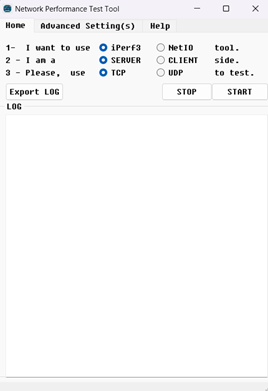

# networkPerfTest

An useful toolkit for the network performance, stress and throughput test.

# UI

# Usage

This tool is still under development. Feel free to open issue or bug report.
To run, please type:
`python main.py`

# Requirements

# License

Iperf3 and NetIO licenses are valid.
Rest is licensed under 
